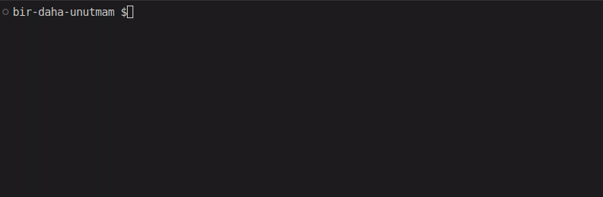

# Bir-Daha-Unutmam

Bir-Daha-Unutmam, notlarınızı kategorize etmenize yardımcı olan, OpenAI GPT-4 modelleri ve Redis kullanarak notlarınızdaki benzerliklere göre otomatik sınıflandırma yapan bir Python uygulamasıdır.

## Demo



## Önemli Uyarı

OpenAI API'si ücretlidir ve kullanım sınırlamaları vardır. Uygulamayı kullanırken OpenAI API kullanımınızı dikkatlice izleyin ve maliyetlerin farkında olun. Daha fazla bilgi için [OpenAI fiyatlandırma sayfasını](https://openai.com/pricing) ziyaret edin.

## API Anahtarını Ayarlama

Uygulamayı kullanmak için OpenAI API anahtarınızı ortam değişkeni olarak ayarlamalısınız.

### Linux ve macOS

Terminalde aşağıdaki komutu çalıştırarak ortam değişkenini ayarlayın (API anahtarınızı yerleştirin):

```bash
export OPENAI_API_KEY='api_anaharınız'
```

## Kurulum

Öncelikle, bu projeyi klonlayın ve projenin ana dizinine gidin:

```bash
git clone https://github.com/cagbal/bir-daha-unutmam
cd bir-daha-unutmam
```

Daha sonra, projedeki bağımlılıkları yükleyin:

```bash
pip install -r requirements.txt
```

Kullanım
Ana dizinde app.py adlı bir Python dosyası oluşturun ve önceki mesajlarda sağlanan kodları bu dosyaya yerleştirin.

Projenin çalışması için notlar adında bir klasör oluşturun ve bu klasöre .md uzantılı not dosyalarınızı ekleyin. Dosya adlarını tarih formatında kullanın (örneğin, 09_04_2023.md).

Redis sunucusunu kurun ve çalıştırın:

```bash
sudo apt-get install redis-server
sudo systemctl start redis
```

Uygulamayı çalıştırın:

```bash
python app.py
```

Eğer belirli bir not dosyasının embeddings'ini güncellemek isterseniz, şu komutu kullanın:

```bash
python app.py --dosya 09_04_2023.md
```

Tüm not dosyalarının embeddings'ini güncellemek için şu komutu kullanın:

```bash
python app.py --dosya hepsi
```

## Lisans
Biraz değiştirilmiş DO WHAT THE FUCK YOU WANT TO PUBLIC LICENSE

Diğer kütüphanelerin lisanslarını incelemeniz gerekebilir. Ona karışmam.